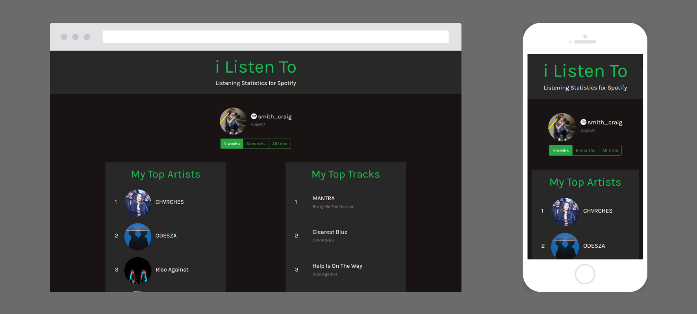

# iListenTo
Listening Statistics for Spotify

iListenTo allows Spotify users to see their top listened to artists and tracks of the last 4 weeks, 6 months, and all time. This information is accessible through the Spotify Web API, which is authenticated with an Implicit-Grant authentication flow.

## Technologies
* JavaScript
  * jQuery, AJAX
* React
  * JSX
* Bootstrap
* [Spotify Web API](https://developer.spotify.com/documentation/web-api/)

## Build + Run Locally
1. Execute 'run.bat' to start Babel, which compiles JSX to regular JavaScript
1. Host webpage locally (I recommend [http-server](https://www.npmjs.com/package/http-server))
1. Edit /src/react.jsx
   1. Replace clientID with a valid one (You get this from [Spotify](https://developer.spotify.com/dashboard/))
   1. Replace redriectURL with your own (Remember to whitelist the URL from your Spotify Developer Dashboard)
1. Done!
